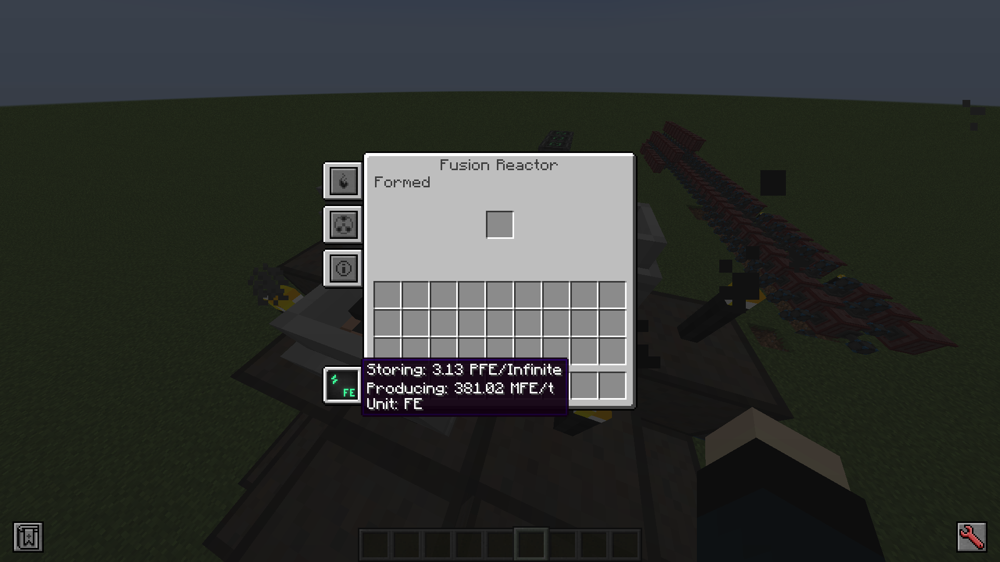
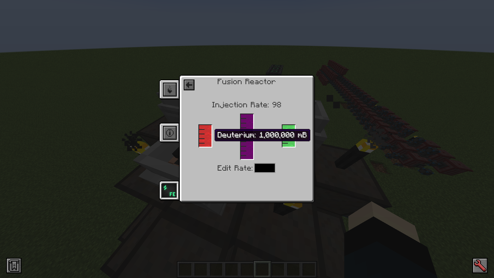
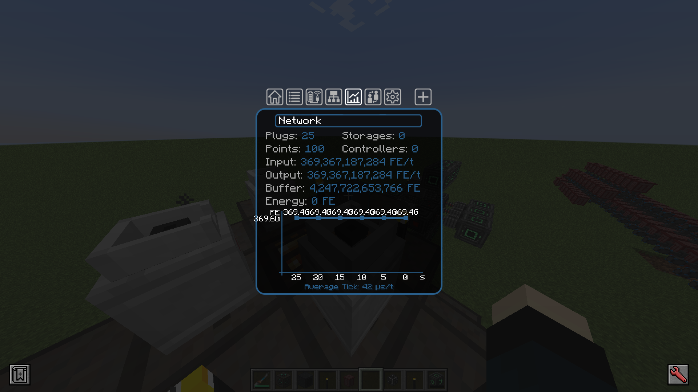

# Mekanism More Capacity

1.18.2 Mekanism の核融合炉の限界を破壊するModです

## 導入方法
[Release](https://github.com/Lapis256/mekanism_more_capacity/releases) からダウンロードしてください

## ギャラリー

見かけ上は無限のエネルギー容量を持つようになった核融合炉

---

Torcherino での加速に耐えられるよう 1000 倍に拡張されたガスタンク

---

限界は未知数

## 1.19.2 以降での利用について
1.19.2 以降の Mekanism では同等の変更がコンフィグから可能になりました
